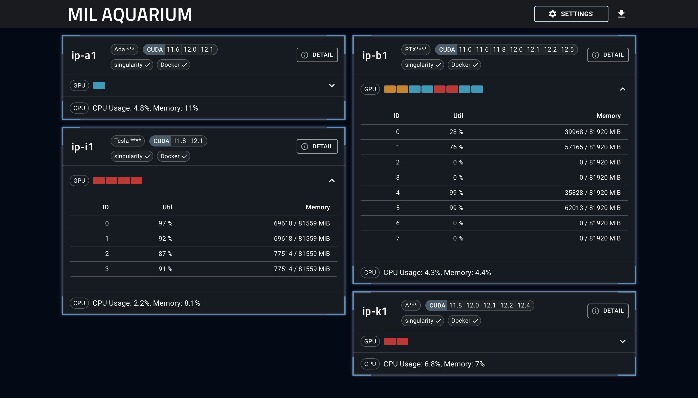

# GPU Dashboard system

[](https://uehara-mech.github.io/gpu-aquarium/#/)



This project is a system that monitors the status of multiple servers with GPUs and displays the status on a web page.

The frontend is implemented in React and Material-UI, and the backend is implemented in Python and fastAPI.

# How to build

```shell
$ cd <project root path>
$ npm run build
```

## Change App Title
You can change the title of the web page by changing `REACT_APP_TITLE` in the `.env` and `.env.production` files.

```shell
REACT_APP_TITLE=AQUARIUM
```


# How to deploy
This project can be deployed to NGINX server.
You need to set the proxy setting in the NGINX configuration file to access the API server.

## Install NGINX
```shell
$ sudo apt update
$ sudo apt install nginx
```

## Check NGINX status
```shell
$ sudo systemctl status nginx
```

## Edit NGINX configuration file
```shell
$ sudo emacs /etc/nginx/sites-available/default
```

Please add the following lines to the configuration file.

```shell
server {
    listen 8080;
    server_name _;

    root <build root path>/build;
    index index.html index.htm;

    location / {
	try_files $uri /index.html;
    }

    location /api/ {
    	     proxy_pass http://localhost:8000/;
	     proxy_set_header Host $host;
	     proxy_set_header X-Real-IP $remote_addr;
	     proxy_set_header X-Forwarded-For $proxy_add_x_forwarded_for;
	     proxy_set_header X-Forwarded-Proto $scheme;
    }
}
```

## Restart NGINX
```shell
$ sudo systemctl restart nginx
```

Now you can access the web page by accessing `http://<server address>:8080`.

# Backend system
Readme for backend system is [here](backend/Readme.md).
